# Day 2: Core Messaging Patterns

Visual diagrams of the Enterprise Integration Patterns implemented in Chronicle.

## Message Channel (Point-to-Point)

A Point-to-Point Channel ensures that only one receiver consumes any given message.

**Key Properties:**
- Messages are delivered to exactly ONE consumer
- FIFO ordering preserved
- Async send, sync receive with timeout

---

## Messaging Gateway

The Gateway encapsulates messaging-specific code, exposing only domain operations.

**Key Properties:**
- Application code is transport-agnostic
- Configuration determines transport at runtime
- Same interface for local and distributed messaging

---

## Message Endpoint

An Endpoint connects an application to a messaging channel. Chronicle can run as different endpoint types.

**Chronicle Modes:**

---

## Competing Consumers

Multiple consumers compete for messages, enabling parallel processing and load balancing.

```mermaid
flowchart LR
    subgraph Producers
        P1[Producer 1]
        P2[Producer 2]
    end
    
    subgraph Channel
        Q[("Queue")]
    end
    
    subgraph Consumers["Competing Consumers"]
        C1["Consumer 1<br/>🔄 Processing"]
        C2["Consumer 2<br/>⏳ Waiting"]
        C3["Consumer 3<br/>⏳ Waiting"]
    end
    
    P1 & P2 -->|send| Q
    Q -->|"poll"| C1
    Q -.->|"poll (empty)"| C2
    Q -.->|"poll (empty)"| C3
    
    style Q fill:#f9f,stroke:#333,stroke-width:2px
    style C1 fill:#bfb,stroke:#333
```

**Message Distribution:**

---

## Chronicle Architecture (Day 2)

Complete view of Chronicle's messaging architecture:

---

## Pipes and Filters

Divides processing into composable, independent steps connected by channels.

**Key Properties:**
- Each filter is independent and reusable
- Filters can validate, transform, or enrich
- Pipeline can reject events that fail validation
- Entity enrichment adds metadata from registered entities

**Filter Types:**
- **Validation**: `validate_required()`, `validate_actor_email()`
- **Normalization**: `normalize_actor()`, `trim_fields()`
- **Enrichment**: `add_correlation_id()`, `enrich_from_entity()`
- **Logging**: `log_event()`, `log_debug()`

---

## Pattern Relationships

How the patterns work together:

---

## References

- [Message Channel](https://www.enterpriseintegrationpatterns.com/patterns/messaging/MessageChannel.html)
- [Point-to-Point Channel](https://www.enterpriseintegrationpatterns.com/patterns/messaging/PointToPointChannel.html)
- [Messaging Gateway](https://www.enterpriseintegrationpatterns.com/patterns/messaging/MessagingGateway.html)
- [Message Endpoint](https://www.enterpriseintegrationpatterns.com/patterns/messaging/MessageEndpoint.html)
- [Competing Consumers](https://www.enterpriseintegrationpatterns.com/patterns/messaging/CompetingConsumers.html)
- [Pipes and Filters](https://www.enterpriseintegrationpatterns.com/patterns/messaging/PipesAndFilters.html)

