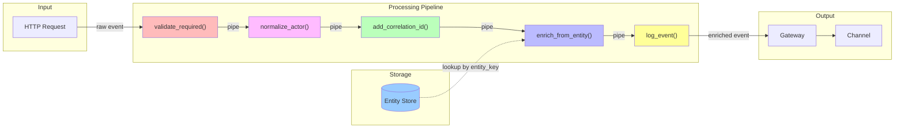
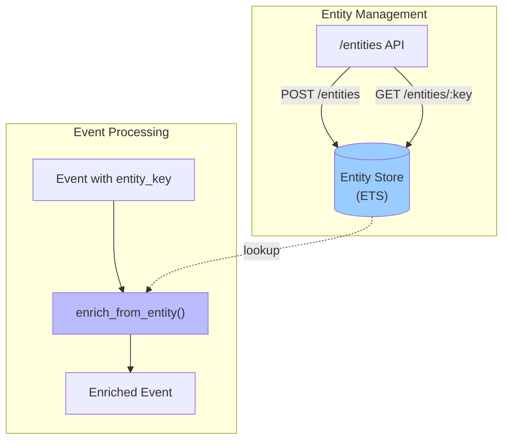

# Plan: Pipes and Filters for Event Processing

## Overview

Implement the **Pipes and Filters** pattern to create a composable event processing pipeline. Events flow through a series of filters, each performing a specific transformation before the event reaches storage.

From EIP:
> *"Divide a larger processing task into a sequence of smaller, independent processing steps (Filters) that are connected by channels (Pipes)."*

## Current State

```gleam
// AuditEvent today
pub type AuditEvent {
  AuditEvent(
    id: String,
    actor: String,
    action: String,
    resource_type: String,
    resource_id: String,
    timestamp: String,
  )
}
```

Events are created in the router and sent directly to the channel with minimal processing.

## Proposed Changes

### 1. Extend AuditEvent with Enrichment Support

Add fields for correlation tracking and extensible metadata:

```gleam
pub type AuditEvent {
  AuditEvent(
    id: String,
    actor: String,
    action: String,
    resource_type: String,
    resource_id: String,
    timestamp: String,
    // New fields for enrichment
    correlation_id: Option(String),     // Links related events
    entity_key: Option(String),         // Custom key for entity lookup
    metadata: Dict(String, String),     // Extensible key-value pairs
  )
}
```

**Why `entity_key`?**
- Allows callers to provide a custom identifier (e.g., `org:acme/user:123`)
- Filters can use this to look up and enrich with additional context
- Decouples the event from knowledge of where enrichment data lives

### 2. Define the Filter Type

```gleam
/// A Filter transforms an event, potentially enriching or validating it
pub type Filter =
  fn(AuditEvent) -> Result(AuditEvent, FilterError)

pub type FilterError {
  ValidationFailed(reason: String)
  EnrichmentFailed(reason: String)
  Skipped(reason: String)
}
```

### 3. Create a Pipeline Module

```gleam
// src/auditor/pipeline.gleam

/// A Pipeline is an ordered list of filters
pub type Pipeline =
  List(Filter)

/// Run an event through all filters in sequence
pub fn process(pipeline: Pipeline, event: AuditEvent) -> Result(AuditEvent, FilterError) {
  list.fold(pipeline, Ok(event), fn(result, filter) {
    result |> result.try(filter)
  })
}

/// Compose two pipelines
pub fn compose(a: Pipeline, b: Pipeline) -> Pipeline {
  list.concat([a, b])
}
```

### 4. Entity Registry

Create an entity store for enrichment lookups with API endpoints.

#### Entity Type

```gleam
// src/auditor/entity.gleam

pub type Entity {
  Entity(
    key: String,              // e.g., "org:acme", "user:123", "project:alpha"
    name: String,             // Human-readable name
    attributes: Dict(String, String),  // Arbitrary metadata
  )
}
```

#### Entity Store

```gleam
// src/auditor/entity_store.gleam

/// ETS-backed entity registry
pub type EntityTable

pub fn init() -> EntityTable
pub fn put(table: EntityTable, entity: Entity) -> Nil
pub fn get(table: EntityTable, key: String) -> Result(Entity, Nil)
pub fn delete(table: EntityTable, key: String) -> Nil
pub fn list_all(table: EntityTable) -> List(Entity)
```

#### API Endpoints

```
POST   /entities          - Register an entity
GET    /entities          - List all entities
GET    /entities/:key     - Get entity by key
DELETE /entities/:key     - Remove an entity
```

**Register Entity:**
```bash
curl -X POST http://localhost:8080/entities \
  -H "Content-Type: application/json" \
  -d '{
    "key": "org:acme",
    "name": "Acme Corporation",
    "attributes": {
      "tier": "enterprise",
      "region": "us-west",
      "owner": "alice@acme.com"
    }
  }'
```

**Response:**
```json
{
  "status": "created",
  "key": "org:acme"
}
```

**Get Entity:**
```bash
curl http://localhost:8080/entities/org:acme
```

```json
{
  "key": "org:acme",
  "name": "Acme Corporation",
  "attributes": {
    "tier": "enterprise",
    "region": "us-west",
    "owner": "alice@acme.com"
  }
}
```

### 5. Built-in Filters

Create reusable filters in `src/auditor/filters.gleam`:

```gleam
/// Validate required fields are present
pub fn validate_required() -> Filter {
  fn(event) {
    case event.actor, event.action, event.resource_type {
      "", _, _ -> Error(ValidationFailed("actor is required"))
      _, "", _ -> Error(ValidationFailed("action is required"))
      _, _, "" -> Error(ValidationFailed("resource_type is required"))
      _, _, _ -> Ok(event)
    }
  }
}

/// Normalize actor email to lowercase
pub fn normalize_actor() -> Filter {
  fn(event) {
    Ok(AuditEvent(..event, actor: string.lowercase(event.actor)))
  }
}

/// Add correlation ID if not present
pub fn add_correlation_id() -> Filter {
  fn(event) {
    case event.correlation_id {
      Some(_) -> Ok(event)
      None -> Ok(AuditEvent(..event, correlation_id: Some(uuid.v4_string())))
    }
  }
}

/// Enrich from entity registry based on entity_key
pub fn enrich_from_entity(entity_store: EntityTable) -> Filter {
  fn(event) {
    case event.entity_key {
      Some(key) -> {
        case entity_store.get(entity_store, key) {
          Ok(entity) -> {
            // Merge entity attributes into event metadata
            let metadata = event.metadata
              |> dict.insert("entity_name", entity.name)
              |> dict.merge(entity.attributes)
            Ok(AuditEvent(..event, metadata: metadata))
          }
          Error(Nil) -> {
            // Entity not found - continue without enrichment
            log.warn("Entity not found for key: " <> key)
            Ok(event)
          }
        }
      }
      None -> Ok(event)
    }
  }
}

/// Log the event passing through (passthrough filter)
pub fn log_event(prefix: String) -> Filter {
  fn(event) {
    log.info(prefix <> ": " <> event.id <> " " <> event.action)
    Ok(event)
  }
}
```

### 5. Integrate with Gateway

The gateway processes events through the pipeline before sending:

```gleam
// In gateway.gleam

pub fn send_event(gateway: Gateway, event: AuditEvent) -> Result(Nil, String) {
  // Process through pipeline first
  case pipeline.process(gateway.pipeline, event) {
    Ok(enriched_event) -> do_send(gateway, enriched_event)
    Error(ValidationFailed(reason)) -> Error("Validation failed: " <> reason)
    Error(EnrichmentFailed(reason)) -> {
      log.warn("Enrichment failed, sending original: " <> reason)
      do_send(gateway, event)
    }
    Error(Skipped(reason)) -> {
      log.info("Event skipped: " <> reason)
      Ok(Nil)
    }
  }
}
```

### 6. Configuration

Define pipelines via configuration:

```gleam
// Default pipeline
pub fn default_pipeline() -> Pipeline {
  [
    filters.validate_required(),
    filters.normalize_actor(),
    filters.add_correlation_id(),
    filters.enrich_from_entity_key(),
    filters.log_event("[pipeline]"),
  ]
}
```

## API Changes

### 1. Register Entities for Enrichment

First, register entities that events can reference:

```bash
# Register an organization
curl -X POST http://localhost:8080/entities \
  -d '{
    "key": "org:acme",
    "name": "Acme Corporation",
    "attributes": {"tier": "enterprise", "region": "us-west"}
  }'

# Register a project
curl -X POST http://localhost:8080/entities \
  -d '{
    "key": "project:alpha",
    "name": "Project Alpha",
    "attributes": {"status": "active", "team": "platform"}
  }'
```

### 2. Create Events with Entity Keys

```bash
# Before
curl -X POST http://localhost:8080/events \
  -d '{"actor":"Alice@ACME.com","action":"create","resource_type":"doc","resource_id":"123"}'

# After (with optional enrichment fields)
curl -X POST http://localhost:8080/events \
  -d '{
    "actor": "Alice@ACME.com",
    "action": "create",
    "resource_type": "document",
    "resource_id": "123",
    "entity_key": "org:acme",
    "correlation_id": "req-abc-123"
  }'
```

### 3. Response (enriched from entity registry)

```json
{
  "id": "evt-uuid",
  "actor": "alice@acme.com",
  "action": "create",
  "resource_type": "document",
  "resource_id": "123",
  "timestamp": "2025-12-17T...",
  "correlation_id": "req-abc-123",
  "entity_key": "org:acme",
  "metadata": {
    "entity_name": "Acme Corporation",
    "tier": "enterprise",
    "region": "us-west"
  }
}
```

### 4. Query Entities

```bash
# List all entities
curl http://localhost:8080/entities

# Get specific entity
curl http://localhost:8080/entities/org:acme

# Delete entity
curl -X DELETE http://localhost:8080/entities/org:acme
```

## File Changes

| File | Change |
|------|--------|
| `src/auditor/event.gleam` | Add `correlation_id`, `entity_key`, `metadata` fields |
| `src/auditor/entity.gleam` | New - Entity type definition |
| `src/auditor/entity_store.gleam` | New - ETS-backed entity registry |
| `src/auditor/pipeline.gleam` | New - Pipeline type and `process` function |
| `src/auditor/filters.gleam` | New - Built-in filter implementations |
| `src/auditor/gateway.gleam` | Integrate pipeline processing, hold entity store ref |
| `src/auditor/router.gleam` | Add `/entities` endpoints, parse new event fields |
| `test/pipeline_test.gleam` | New - Unit tests for filters and pipeline |
| `test/entity_store_test.gleam` | New - Unit tests for entity registry |
| `docs/day-2-patterns.md` | Add Pipes and Filters diagram |

## Diagram



### Entity Registry Flow



## Implementation Order

1. **Extend `AuditEvent`** with new fields (backwards compatible)
2. **Create `entity.gleam`** and `entity_store.gleam` - entity registry
3. **Add entity API endpoints** to router (`/entities`)
4. **Create `pipeline.gleam`** with types and `process` function
5. **Create `filters.gleam`** with built-in filters (including entity enrichment)
6. **Add tests** for entity store, pipeline, and filters
7. **Integrate** pipeline into gateway
8. **Update router** to parse new event fields
9. **Update docs** with pattern diagram

## Future Extensions

- **Async filters** - filters that call external services
- **Filter metrics** - track processing time per filter
- **Conditional filters** - apply filters based on event properties
- **Error recovery filters** - retry or fallback strategies
- **Filter composition** - combine filters with `and_then`, `or_else`

## Questions for Review

1. Should `metadata` be `Dict(String, String)` or `Dict(String, Dynamic)` for flexibility?
2. Should failed validation return HTTP 400, or should we have a separate validation endpoint?
3. Should the pipeline be configurable per-request, or global?
4. Do we want a "skip" result that drops the event silently (e.g., for filtering)?

